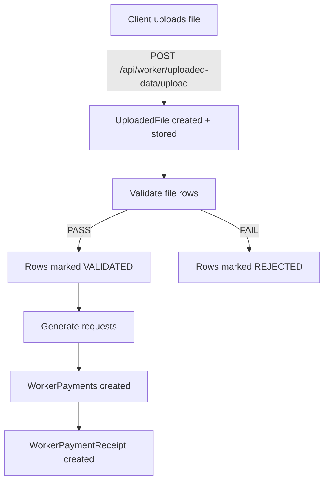
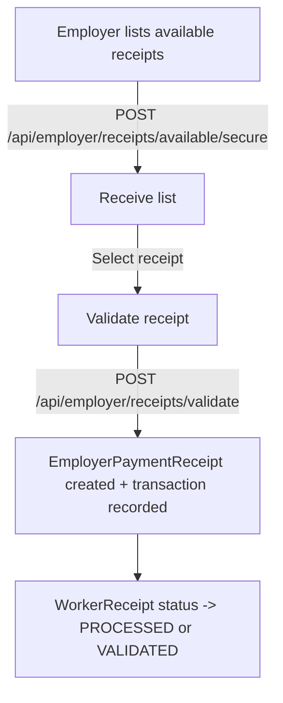

# Payment Flow Service — Quick Guide

A compact, user-friendly guide to the Payment Flow Service. This README focuses on how things work, shows flow diagrams to explain the main processes, and provides concrete examples you can copy-paste to run and test locally.

> Note: This project is a Spring Boot 3.x microservice for ingesting worker payment files, validating and transforming them, generating payment receipts, and supporting employer validation.

## Table of contents
- Overview
- Quick start (run locally)
- Main flows (diagrams + examples)
  - Worker file ingestion & validation
  - Receipt creation & send-to-employer
  - Employer validation
- APIs / Examples (curl + payloads)
- Configuration highlights
- Troubleshooting & tips

---

## Overview

Core responsibilities:
- Accept CSV/XLS/XLSX worker payment uploads and persist metadata + staging rows.
- Validate and transform rows into internal payment requests.
- Generate worker payment receipts and allow sending them to employers.
- Allow employers to validate receipts and record bank transaction references.

Important domain objects:
- UploadedFile (`uploaded_files`) — metadata about an uploaded file.
- WorkerUploadedData (`worker_uploaded_data`) — row-level staging records.
- WorkerPayment (`worker_payments`) — finalized worker payments.
- WorkerPaymentReceipt (`worker_payment_receipts`) — batch summaries for processed payments.
- EmployerPaymentReceipt (`employer_payment_receipts`) — created after employer confirms bank transaction.

---

## Quick start (run locally)

Prereqs:
- Java 17
- Maven 3.9+
- MySQL 8.x (create schema `payment_flow_db` before starting)

Create DB:

```sql
CREATE DATABASE payment_flow_db CHARACTER SET utf8mb4 COLLATE utf8mb4_unicode_ci;
```

Build and run:

```bash
mvn -DskipTests clean package
mvn spring-boot:run -Dspring-boot.run.profiles=dev
# or
java -jar target/payment-flow-service-0.0.1-SNAPSHOT.jar --spring.profiles.active=dev
```

Helpful endpoints after startup (defaults to port 8081 in `dev` profile):
- Health: GET http://localhost:8081/actuator/health
- OpenAPI: GET http://localhost:8081/v3/api-docs
- Swagger UI: http://localhost:8081/swagger-ui/index.html

If you don't have an auth service for bearer tokens, set the shared security flag off for local testing:

```bash
export SHARED_LIB_SECURITY_ENABLED=false
# or set shared-lib.security.enabled=false in a custom application profile
```

---

## Main flows (diagrams + examples)

Notes on diagrams: the repository README now uses Mermaid syntax for flow diagrams. If your markdown viewer doesn't render Mermaid, use a compatible viewer (VS Code with the "Markdown Preview Mermaid Support" extension does).

### 1) Worker file ingestion -> validation -> request generation

Mermaid flow:



Example: Upload + validate + generate (high-level):
1. Upload file (CSV):
   - POST /api/worker/uploaded-data/upload (multipart/form-data)
   - Response: { fileId, storedPath, recordCount }
2. Validate uploaded data:
   - POST /api/worker/uploaded-data/file/{fileId}/validate
   - Response: validation summary (counts pass/fail) and errors file link when applicable
3. Generate requests from validated rows:
   - POST /api/worker/uploaded-data/file/{fileId}/generate-request
   - Response: updated status counts and generated request identifiers

Edge cases:
- File with zero rows: validation returns zero processed; check column headers.
- Large files (up to 200 MB): ensure server has sufficient upload limits and disk space.

---

### 2) Receipt creation and send-to-employer

Mermaid flow:

```mermaid
flowchart LR
  P[WorkerPayments pool] -->|service| RC[Create WorkerPaymentReceipt]
  RC -->|POST /api/worker/receipts/{receiptNumber}/send-to-employer| E[Set status PAYMENT_INITIATED]
  E --> EP[Create EmployerPaymentReceipt (PENDING)]
  EP -->|notify employer| EM[Employer system reviews]
```

Example sequence:
- Worker payments get processed by internal logic (service call WorkerPaymentReceiptService#createReceipt).
- To send a created receipt to employer:
  - POST /api/worker/receipts/{receiptNumber}/send-to-employer
  - Result: Worker receipt status -> PAYMENT_INITIATED; associated WorkerPayments -> PAYMENT_INITIATED; EmployerPaymentReceipt created (PENDING)

Edge cases:
- Receipt already in non-eligible state (e.g., CANCELLED): the API should return 4xx with a clear message.

---

### 3) Employer validation

Mermaid flow:



Example: Employer validates a worker receipt using bank transaction reference:

Request payload:
```json
{
  "workerReceiptNumber": "RCP-20241030-123456-001",
  "transactionReference": "TRX-123456789",
  "validatedBy": "finance.user@company.com"
}
```

Response: employer receipt metadata (receipt numbers, totals, timestamp).

Edge cases:
- Duplicate transactionReference: service should detect duplicates and reject or flag for review.
- Receipt already validated: returns 409 or a meaningful validation error.

---

## APIs — quick list & copyable examples

1) Upload file (worker)

curl example (replace TOKEN and path):

```bash
curl -X POST "http://localhost:8081/api/worker/uploaded-data/upload" \
  -H "Authorization: Bearer $TOKEN" \
  -F "file=@/path/to/worker_data.csv"
```

2) Validate file

```bash
curl -X POST "http://localhost:8081/api/worker/uploaded-data/file/{fileId}/validate" \
  -H "Authorization: Bearer $TOKEN"
```

3) Generate requests

```bash
curl -X POST "http://localhost:8081/api/worker/uploaded-data/file/{fileId}/generate-request" \
  -H "Content-Type: application/json" \
  -H "Authorization: Bearer $TOKEN" \
  -d '{"uploadedFileRef":"optional-custom-ref"}'
```

4) Send receipt to employer

```bash
curl -X POST "http://localhost:8081/api/worker/receipts/{receiptNumber}/send-to-employer" \
  -H "Authorization: Bearer $TOKEN"
```

5) Employer validate

```bash
curl -X POST "http://localhost:8081/api/employer/receipts/validate" \
  -H "Content-Type: application/json" \
  -H "Authorization: Bearer $TOKEN" \
  -d '{"workerReceiptNumber":"RCP-20241030-123456-001","transactionReference":"TRX-123456789","validatedBy":"finance.user@company.com"}'
```

---

## Configuration highlights

Key files: `src/main/resources/application.yml` and `application-dev.yml`.

Important properties for local runs:
- `spring.profiles.active=dev` (set via -D or env)
- Datasource: `spring.datasource.url`, `spring.datasource.username`, `spring.datasource.password`
- JWT / auth introspection: `${AUTH_SERVICE_BASE_URL:http://auth-service:8080}/internal/auth/introspect`
- File upload base dir: `file.upload.base-dir` (default `uploads/dev/` in dev)
- Logging: dev profile writes to `logs/dev.log`
- Feature toggles: `shared-lib.*` flags (security, entity audit, filters)

To disable security for local smoke tests:

```bash
export SHARED_LIB_SECURITY_ENABLED=false
mvn spring-boot:run -Dspring-boot.run.profiles=dev
```

---

## Troubleshooting & tips

- Database connection refused: make sure MySQL is running and `payment_flow_db` exists.
- Validation returns zero records: confirm the CSV has expected headers (case-sensitive).
- Secure pagination 400: ensure `startDate` and `endDate` are provided and valid ISO-8601.
- Authorization failures: either provide a valid bearer token or disable the shared security filter for local runs.
- Large uploads: watch the JVM max heap / multipart upload limits and disk space.

---

## Next steps (recommended)
- Add integration tests for: file upload -> validate -> generate -> create receipts.
- Add a small example CSV in `uploads/dev/` and a health-check script to speed local testing.
- Consider documenting API response shapes and error codes in more detail (OpenAPI is available at /v3/api-docs).

---

(End of guide) — if you want, I can also:
- add a sample CSV file under `uploads/dev/` and a tiny script that runs the full happy-path locally, or
- produce MD diagrams as PNGs for inclusion in the repo if Mermaid isn't supported by your viewers.

