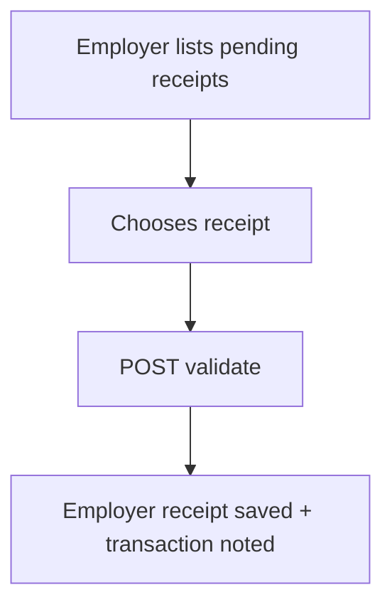

# Payment Flow Service — Beginner-Friendly Guide

Welcome! This guide walks you through the basics of the Payment Flow Service. It explains what the service does, how to run it locally, and how to try the core workflows even if you are new to Spring Boot or payment systems.

---

## Table of Contents
- [What the Service Does](#what-the-service-does)
- [Key Vocabulary](#key-vocabulary)
- [Before You Begin](#before-you-begin)
- [Start the Service Locally](#start-the-service-locally)
- [Understand the Main Workflows](#understand-the-main-workflows)
  - [A. Upload ➜ Validate ➜ Generate Requests](#a-upload--validate--generate-requests)
  - [B. Create Receipt ➜ Send to Employer](#b-create-receipt--send-to-employer)
  - [C. Employer Reviews and Confirms](#c-employer-reviews-and-confirms)
- [Try the APIs (Copy & Paste Examples)](#try-the-apis-copy--paste-examples)
- [Configuration Essentials](#configuration-essentials)
- [Troubleshooting Tips](#troubleshooting-tips)
- [Next Steps](#next-steps)

---

## What the Service Does
- Accepts worker payment files (CSV/XLS/XLSX) and stores both the file and each row.
- Validates each row, marks issues, and can turn clean rows into worker payment requests.
- Groups processed payments into **worker receipts** and lets you send them to employers.
- Lets employers confirm a worker receipt and record the bank transaction they used.

Entity-level auditing is disabled for these tables: `worker_payment_receipts`, `worker_uploaded_data`, and `uploaded_files`. High-level actions are still tracked via service-level audit annotations where configured.

---

## Key Vocabulary
| Term | What it means |
|------|---------------|
| **UploadedFile** | Metadata about a file you uploaded (name, path, status, counts). |
| **WorkerUploadedData** | Every row extracted from the uploaded file. Status changes from `UPLOADED` ➜ `VALIDATED` or `REJECTED`. |
| **WorkerPayment** | A confirmed payment record for a worker. |
| **WorkerPaymentReceipt** | A batch summary for a set of worker payments (think “receipt packet”). |
| **EmployerPaymentReceipt** | Created when employers confirm the worker receipt and provide a bank transaction reference. |

---

## Before You Begin
1. **Install tools**
   - Java 17: `java -version`
   - Maven 3.9+: `mvn -v`
   - MySQL 8.x: `mysql --version`
2. **Create the database**
   ```sql
   CREATE DATABASE payment_flow_db CHARACTER SET utf8mb4 COLLATE utf8mb4_unicode_ci;
   ```
3. **Clone this repository**
   ```bash
   git clone <repo-url>
   cd payment-flow-service
   ```
4. **(Optional) Disable auth for local experiments**  
   ```bash
   export SHARED_LIB_SECURITY_ENABLED=false
   ```
   Skip this if you already have a bearer token and a running auth service.

---

## Start the Service Locally
1. **Build the project**
   ```bash
   mvn -DskipTests clean package
   ```
2. **Run the service (dev profile)**  
   Either use Maven:
   ```bash
   mvn spring-boot:run -Dspring-boot.run.profiles=dev
   ```
   or run the packaged jar:
   ```bash
   java -jar target/payment-flow-service-0.0.1-SNAPSHOT.jar --spring.profiles.active=dev
   ```
3. **Verify it is running (default port 8081 in dev)**
   - Health check: `curl http://localhost:8081/actuator/health`
   - API docs (JSON): `http://localhost:8081/v3/api-docs`
   - Swagger UI: `http://localhost:8081/swagger-ui/index.html`
4. **Logs**
   - Console output shows real-time activity.
   - File logs (dev profile) write to `logs/dev.log`.

---

## Understand the Main Workflows
Each workflow below includes a plain-language description, an optional Mermaid diagram (viewable in tools like VS Code with the “Markdown Preview Mermaid Support” extension), and the API steps you call.

### A. Upload ➜ Validate ➜ Generate Requests
**What happens**
1. You upload a worker payment spreadsheet.
2. The service saves the file and each row.
3. Validation checks every row for issues.
4. Valid rows are ready to become payment requests.

**Diagram**
```mermaid
flowchart TD
  U[Upload file] --> S[Stored as UploadedFile + WorkerUploadedData rows]
  S --> V[Validate rows]
  V -->|Pass| R[Rows marked VALIDATED]
  V -->|Fail| F[Rows marked REJECTED]
  R --> G[Generate requests (optional)]
  G --> W[Worker payments ready]
```

### B. Create Receipt ➜ Send to Employer
**What happens**
1. Internally, validated payments are grouped into a worker payment receipt.
2. You call a “send” endpoint.
3. The worker receipt status becomes `PAYMENT_INITIATED`, and worker payments are updated.
4. An employer-facing receipt is created so their team can review it.

**Diagram**
```mermaid
flowchart LR
  P[Worker Payments] --> RC[Create Worker Receipt]
  RC -->|POST send-to-employer| S[Status PAYMENT_INITIATED]
  S --> EP[Employer Receipt (PENDING)]
```

### C. Employer Reviews and Confirms
**What happens**
1. Employers list pending receipts.
2. They pick a receipt and submit a validation payload with the bank transaction reference.
3. The service saves an employer receipt and marks the worker receipt accordingly.

**Diagram**


---

## Try the APIs (Copy & Paste Examples)
Replace `{fileId}`, `{receiptNumber}`, and `$TOKEN` with real values. All endpoints expect `Authorization: Bearer <token>` unless you disabled security.

1. **Upload a worker file**
   ```bash
   curl -X POST "http://localhost:8081/api/worker/uploaded-data/upload" \
     -H "Authorization: Bearer $TOKEN" \
     -F "file=@/path/to/worker_data.csv"
   ```
   Response includes a `fileId` you use later.

2. **Validate the uploaded rows**
   ```bash
   curl -X POST "http://localhost:8081/api/worker/uploaded-data/file/{fileId}/validate" \
     -H "Authorization: Bearer $TOKEN"
   ```

3. **Generate request numbers for validated rows**
   ```bash
   curl -X POST "http://localhost:8081/api/worker/uploaded-data/file/{fileId}/generate-request" \
     -H "Authorization: Bearer $TOKEN" \
     -H "Content-Type: application/json" \
     -d '{"uploadedFileRef":"optional-custom-ref"}'
   ```

4. **Send a worker receipt to the employer**
   ```bash
   curl -X POST "http://localhost:8081/api/worker/receipts/{receiptNumber}/send-to-employer" \
     -H "Authorization: Bearer $TOKEN"
   ```

5. **Employer confirms the receipt**
   ```bash
   curl -X POST "http://localhost:8081/api/employer/receipts/validate" \
     -H "Authorization: Bearer $TOKEN" \
     -H "Content-Type: application/json" \
     -d '{
           "workerReceiptNumber": "RCP-20241030-123456-001",
           "transactionReference": "TRX-123456789",
           "validatedBy": "finance.user@company.com"
         }'
   ```

Need paginated listings? The secure endpoints require `startDate` and `endDate` (ISO-8601). Example:
```bash
curl -X POST "http://localhost:8081/api/worker/uploaded-data/secure-paginated" \
  -H "Authorization: Bearer $TOKEN" \
  -H "Content-Type: application/json" \
  -d '{
        "startDate": "2024-01-01",
        "endDate": "2024-01-31",
        "page": 0,
        "size": 25,
        "sortBy": "createdAt",
        "sortDir": "desc"
      }'
```

---

## Configuration Essentials
Configuration lives in `src/main/resources/application.yml` and `application-dev.yml`.

| Area | Property | Notes |
|------|----------|-------|
| Database | `spring.datasource.*` | `application-dev.yml` points at `jdbc:mysql://localhost:3306/payment_flow_db` with user `root`/`root`. |
| Profile | `spring.profiles.active` | Defaults to `dev`. Override with `--spring.profiles.active=prod`. |
| File uploads | `file.upload.base-dir` | Dev profile stores files under `uploads/dev/`. The app must have read/write permissions. |
| Security | `shared-lib.security.enabled` | Set to `false` for local smoke testing without bearer tokens. |
| Pagination | Secure endpoints require `startDate` and `endDate` and limit sort fields to safe values. |
| Logging | Dev profile writes to `logs/dev.log` and the console with request correlation IDs when provided. |
| Auditing | Entity-level auditing is disabled for worker receipts, worker uploaded data, and uploaded files. `@Auditable` annotations on controllers/services still trigger high-level audit events. |

---

## Troubleshooting Tips
- **Database connection refused**  
  Ensure MySQL is running, the `payment_flow_db` schema exists, and credentials match the config.
- **Validation returns zero rows**  
  Check the spreadsheet headers; they are case-sensitive. Re-download the template if available.
- **Secure pagination returns HTTP 400**  
  Always include `startDate` and `endDate` in ISO-8601 format (e.g., `2024-01-01T00:00:00`).
- **Authorization errors**  
  Provide a valid bearer token or temporarily disable security (`SHARED_LIB_SECURITY_ENABLED=false`) for local testing.
- **Large uploads fail**  
  Files up to 200 MB are allowed. Increase JVM heap size (`-Xmx`) and ensure `uploads/dev/` has enough space.

---

## Next Steps
- Add automated integration tests that exercise the entire file upload ➜ validate ➜ generate ➜ send-to-employer flow.
- Create or request a sample CSV to drop into `uploads/dev/` so teammates can practice quickly.
- Review the OpenAPI docs (`/v3/api-docs` or Swagger UI) for full request/response schemas.
- If you need non-Mermaid diagrams, export the provided flows to PNG and store them in the repository wiki.

Happy testing! If anything here is unclear, leave comments in the README or open a ticket so we can keep improving this guide.

